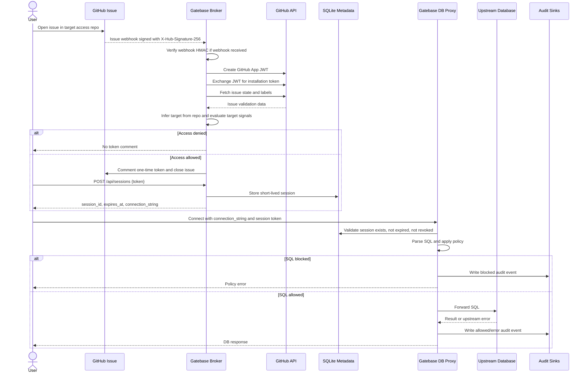
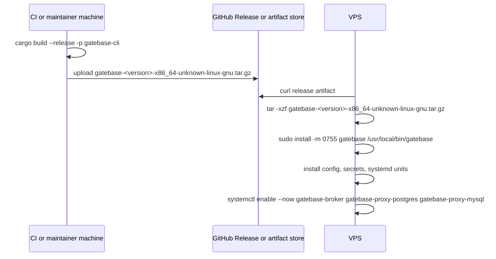

# VPS Setup

This guide runs Gatebase on one Linux VPS with systemd. The broker API is exposed through HTTPS. Database proxy ports should be reachable only from approved client networks.

## Layout

```text
/usr/local/bin/gatebase
/etc/gatebase/gatebase.yaml
/etc/gatebase/session.key
/etc/gatebase/github-app.pem
/var/lib/gatebase/gatebase.db
/var/log/gatebase/audit.jsonl
```

Run one `gatebase` binary with multiple subcommands:

- `gatebase broker`
- `gatebase proxy postgres`
- `gatebase proxy mysql`

## Process Overview

```mermaid
flowchart TD
    Dev[Developer or CI] --> Build[Build gatebase binary or Docker image]
    Build --> Artifact[Release artifact or container registry]
    Artifact --> VPS[VPS installs artifact, no source checkout required]

    Admin[Operator] --> Config[/etc/gatebase/gatebase.yaml]
    Admin --> Secrets[session.key, github-app.pem, DB credential env]
    Config --> Systemd[systemd services]
    Secrets --> Systemd

    Systemd --> Broker[gatebase broker :8080 localhost]
    Systemd --> PgProxy[gatebase proxy postgres :15432]
    Systemd --> MyProxy[gatebase proxy mysql :13306]

    GitHub[GitHub App webhooks/API] --> Nginx[Nginx HTTPS :443]
    User[User requests DB session] --> Nginx
    Nginx --> Broker
    Broker --> GitHub
    Broker --> SQLite[(SQLite sessions/audit)]
    Broker --> ConnString[short-lived connection string]

    User --> PgProxy
    User --> MyProxy
    PgProxy --> SQLite
    MyProxy --> SQLite
    PgProxy --> Policy[SQL policy]
    MyProxy --> Policy
    Policy --> Audit[SQLite + JSONL audit]
    PgProxy --> Postgres[(Upstream Postgres)]
    MyProxy --> MySQL[(Upstream MySQL)]
```

## Session Request Flow



## Build Binary

Build on the VPS or in CI:

```bash
cargo build --release -p gatebase-cli
sudo install -m 0755 target/release/gatebase /usr/local/bin/gatebase
```

Check:

```bash
/usr/local/bin/gatebase --help
```

## Install Without Source Checkout

Preferred VPS flow: build elsewhere, publish artifact, install only the `gatebase` binary.



Example install:

```bash
curl -L -o gatebase.tar.gz \
  https://github.com/ter-net-in/gatebase/releases/download/v0.4.4/gatebase-0.4.4-x86_64-unknown-linux-gnu.tar.gz
tar -xzf gatebase.tar.gz
sudo install -m 0755 gatebase /usr/local/bin/gatebase
```

Manual copy also works:

```bash
scp target/release/gatebase user@vps:/tmp/gatebase
ssh user@vps 'sudo install -m 0755 /tmp/gatebase /usr/local/bin/gatebase'
```

Update an installed binary from GitHub Releases:

```bash
sudo /usr/local/bin/gatebase update
sudo systemctl restart gatebase-broker gatebase-proxy-postgres gatebase-proxy-mysql
```

## Create User And Directories

```bash
sudo useradd --system --home /var/lib/gatebase --shell /usr/sbin/nologin gatebase
sudo mkdir -p /etc/gatebase /var/lib/gatebase /var/log/gatebase
sudo chown gatebase:gatebase /var/lib/gatebase /var/log/gatebase
sudo chmod 0750 /etc/gatebase /var/lib/gatebase /var/log/gatebase
```

## Secrets

Create session signing key:

```bash
sudo openssl rand -base64 32 | sudo tee /etc/gatebase/session.key >/dev/null
sudo chown root:gatebase /etc/gatebase/session.key
sudo chmod 0640 /etc/gatebase/session.key
```

Install GitHub App private key:

```bash
sudo install -o root -g gatebase -m 0640 github-app.pem /etc/gatebase/github-app.pem
```

See `docs/github-app-setup.md` for GitHub App creation, permissions, webhook secret, app ID, and installation ID.

## Environment File

Create upstream DB credentials:

```bash
sudo tee /etc/gatebase/gatebase.env >/dev/null <<'EOF'
PG_UPSTREAM_USER=gatebase_service
PG_UPSTREAM_PASSWORD=change-me
MYSQL_UPSTREAM_USER=gatebase_service
MYSQL_UPSTREAM_PASSWORD=change-me
EOF
sudo chown root:gatebase /etc/gatebase/gatebase.env
sudo chmod 0640 /etc/gatebase/gatebase.env
```

## Config

Create `/etc/gatebase/gatebase.yaml`:

```yaml
server:
  public_url: "https://gatebase.example.com"
  broker_listen: "127.0.0.1:8080"

metadata:
  sqlite_path: "/var/lib/gatebase/gatebase.db"

sessions:
  default_ttl: "15m"
  max_ttl: "30m"
  signing_key_file: "/etc/gatebase/session.key"

github:
  app_id: "123456"
  installation_id: 987654
  private_key_file: "/etc/gatebase/github-app.pem"
  webhook_secret: "change-me"
  api_base_url: "https://api.github.com"

audit:
  fail_closed: true
  sinks:
    - type: "sqlite"
    - type: "jsonl"
      path: "/var/log/gatebase/audit.jsonl"

targets:
  - name: "prod-pg"
    engine: "postgres"
    access:
      github_repo: "org/repo"
      access_token_ttl: "5m"
      required_signals:
        - type: "github_issue_open"
        - type: "github_issue_labels"
          labels:
            - "approved"
    listen: "0.0.0.0:15432"
    public_host: "gatebase.example.com"
    public_port: 15432
    upstream: "10.0.0.10:5432"
    database: "app"
    credentials:
      username_env: "PG_UPSTREAM_USER"
      password_env: "PG_UPSTREAM_PASSWORD"

policies:
  default:
    block:
      - "drop_database"
      - "drop_table"
      - "truncate"
      - "alter_system"
      - "set_global"
      - "load_data"
    require_where:
      - "update"
      - "delete"
    max_rows_changed: 1000
```

Protect config:

```bash
sudo chown root:gatebase /etc/gatebase/gatebase.yaml
sudo chmod 0640 /etc/gatebase/gatebase.yaml
```

Validate:

```bash
sudo -u gatebase /usr/local/bin/gatebase config check --config /etc/gatebase/gatebase.yaml
```

Bootstrap the first admin user locally. Replace `change-me` before production use:

```bash
printf 'change-me\n' | sudo -u gatebase /usr/local/bin/gatebase admin user create \
  --config /etc/gatebase/gatebase.yaml \
  --username root \
  --role admin \
  --password-stdin
```

## systemd Units

Quick install can generate all three units:

```bash
sudo /usr/local/bin/gatebase systemd install \
  --config /etc/gatebase/gatebase.yaml \
  --bin /usr/local/bin/gatebase \
  --enable \
  --start
```

The generated units are minimal. For production hardening and DB credential env
files, use units like the examples below.

Broker unit `/etc/systemd/system/gatebase-broker.service`:

```ini
[Unit]
Description=Gatebase Broker
After=network-online.target
Wants=network-online.target

[Service]
User=gatebase
Group=gatebase
EnvironmentFile=/etc/gatebase/gatebase.env
ExecStart=/usr/local/bin/gatebase broker --config /etc/gatebase/gatebase.yaml
Restart=on-failure
RestartSec=5
NoNewPrivileges=true
PrivateTmp=true
ProtectSystem=strict
ProtectHome=true
ReadWritePaths=/var/lib/gatebase /var/log/gatebase
ReadOnlyPaths=/etc/gatebase

[Install]
WantedBy=multi-user.target
```

Postgres proxy unit `/etc/systemd/system/gatebase-proxy-postgres.service`:

```ini
[Unit]
Description=Gatebase Postgres Proxy
After=network-online.target gatebase-broker.service
Wants=network-online.target

[Service]
User=gatebase
Group=gatebase
EnvironmentFile=/etc/gatebase/gatebase.env
ExecStart=/usr/local/bin/gatebase proxy postgres --config /etc/gatebase/gatebase.yaml
Restart=on-failure
RestartSec=5
NoNewPrivileges=true
PrivateTmp=true
ProtectSystem=strict
ProtectHome=true
ReadWritePaths=/var/lib/gatebase /var/log/gatebase
ReadOnlyPaths=/etc/gatebase

[Install]
WantedBy=multi-user.target
```

MySQL proxy unit, if needed, `/etc/systemd/system/gatebase-proxy-mysql.service`:

```ini
[Unit]
Description=Gatebase MySQL Proxy
After=network-online.target gatebase-broker.service
Wants=network-online.target

[Service]
User=gatebase
Group=gatebase
EnvironmentFile=/etc/gatebase/gatebase.env
ExecStart=/usr/local/bin/gatebase proxy mysql --config /etc/gatebase/gatebase.yaml
Restart=on-failure
RestartSec=5
NoNewPrivileges=true
PrivateTmp=true
ProtectSystem=strict
ProtectHome=true
ReadWritePaths=/var/lib/gatebase /var/log/gatebase
ReadOnlyPaths=/etc/gatebase

[Install]
WantedBy=multi-user.target
```

Enable services:

```bash
sudo systemctl daemon-reload
sudo systemctl enable --now gatebase-broker
sudo systemctl enable --now gatebase-proxy-postgres
# sudo systemctl enable --now gatebase-proxy-mysql
```

Check logs:

```bash
sudo journalctl -u gatebase-broker -f
sudo journalctl -u gatebase-proxy-postgres -f
```

## Reverse Proxy

Expose only broker HTTP through HTTPS. Example Nginx server block:

```nginx
server {
    listen 443 ssl http2;
    server_name gatebase.example.com;

    ssl_certificate /etc/letsencrypt/live/gatebase.example.com/fullchain.pem;
    ssl_certificate_key /etc/letsencrypt/live/gatebase.example.com/privkey.pem;

    location / {
        proxy_pass http://127.0.0.1:8080;
        proxy_set_header Host $host;
        proxy_set_header X-Forwarded-Proto https;
        proxy_set_header X-Forwarded-For $proxy_add_x_forwarded_for;
    }
}
```

Set GitHub webhook URL to:

```text
https://gatebase.example.com/webhooks/github
```

Protected broker endpoints require `Authorization: Bearer <token>`. Run
`gatebase login` after the broker is running; it saves a token that CLI admin
commands reuse automatically. For raw HTTP calls, obtain a token from
`POST /api/admin/login`.

## Firewall

Minimum public exposure:

- `443/tcp` to broker through reverse proxy.
- Proxy ports such as `15432/tcp` only from trusted VPN, bastion, or office IP ranges.
- No direct user access to upstream databases.

Example with UFW:

```bash
sudo ufw allow 443/tcp
sudo ufw allow from 203.0.113.0/24 to any port 15432 proto tcp
sudo ufw deny 15432/tcp
sudo ufw enable
```

## Operations

Backup SQLite and JSONL audit logs:

```bash
sudo systemctl stop gatebase-broker gatebase-proxy-postgres gatebase-proxy-mysql
sudo sqlite3 /var/lib/gatebase/gatebase.db ".backup '/var/lib/gatebase/gatebase.backup.db'"
sudo cp /var/log/gatebase/audit.jsonl /var/log/gatebase/audit.jsonl.backup
sudo systemctl start gatebase-broker gatebase-proxy-postgres gatebase-proxy-mysql
```

Rotate audit logs with logrotate or ship `/var/log/gatebase/audit.jsonl` to centralized storage.

## Smoke Test

Create a session through the broker after configured GitHub signals pass:

```bash
curl -sS https://gatebase.example.com/api/sessions \
  -H 'content-type: application/json' \
  -d '{"token":"gb_at_..."}'
```

Use returned connection string with `psql`.

Authenticate to protected admin endpoints. `gatebase login` saves a token to
`~/.config/gatebase/config.json`, after which CLI admin commands reuse it with no
`--admin-token`:

```bash
printf 'admin-password' | gatebase login \
  --broker https://gatebase.example.com \
  --username root \
  --password-stdin

gatebase audit list --broker https://gatebase.example.com
```

For a raw HTTP call, fetch a token from the login API directly:

```bash
TOKEN=$(curl -sS https://gatebase.example.com/api/admin/login \
  -H 'content-type: application/json' \
  -d '{"username":"root","password":"admin-password"}' \
  | sed -n 's/.*"token":"\([^"]*\)".*/\1/p')

curl -sS https://gatebase.example.com/api/audit/events \
  -H "Authorization: Bearer $TOKEN"
```

Remote admin CLI commands can use either `--broker` or a saved broker URL:

```bash
gatebase config --broker https://gatebase.example.com
gatebase session list --admin-token "$TOKEN"
gatebase maintenance prune --admin-token "$TOKEN" --dry-run
```

Blocked SQL should fail at the proxy and create audit events.
